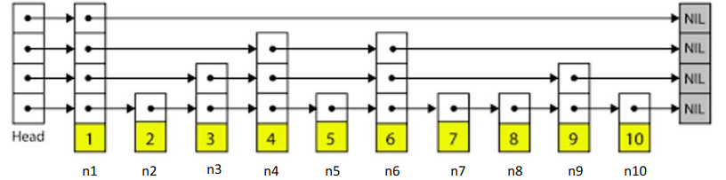

# My understanding about Global Index

[toc]

This summary is based on Qingyang Zhang(ZQY)'s project: [global index in LSM tree in leveldb](https://gitee.com/qingyangZ/leveldb/tree/QingyangZ/).

## Revision to `SkipList`

### FindGreaterOrEqualWithNode

A method of class `SkipList` and it is defined in `db/skiplist.h`.

Given a target `key`, the start node `start_node_`and the start level `start_level_`, this method searches for the first node whose key >= target `key` from `start_node_` below `start_level_`.

```cpp
template <typename Key, class Comparator>
typename SkipList<Key, Comparator>::Node*
SkipList<Key, Comparator>::FindGreaterOrEqualWithNode(const Key& key,
                                                      Node* start_node_,
                                                      int start_level_) const {
  Node* x = start_node_;
  int level = start_level_ - 1;
  while (true) {
    Node* next = x->Next(level);
    if (KeyIsAfterNode(key, next)) {
      // Keep searching in this list
      x = next;
    } else {
      if (level == 0) {
        return next;
      } else {
        // Switch to next list
        level--;
      }
    }
  }
}
```

For example, In skip list shown in Figure 1, if we call `FindGreaterOrEqualWithNode(7, n4, 1)`, it will start at node `n4` on level 1 and will search in blue arrow in Figure 2. It finally returns node `n7`.



 <div align = "center">Figure 1: SkipList</div>


<div align = "center">Figure 2: Seek in SkipList</div>


### SeekWithNode

A method of class `SkipList::Iterator` and it is defined in `db/skiplist.h`.

It is just an encapsulation of  method `FindGreaterOrEqualWithNode()`.

```cpp
template <typename Key, class Comparator>
inline void SkipList<Key, Comparator>::Iterator::SeekWithNode(const Key& target,
                                                              Node* start_node_,
                                                              int start_level) {
  node_ = list_->FindGreaterOrEqualWithNode(target, start_node_, start_level);
}
```


###  GetLongestPathNode

A method of class `SkipList` and it is defined in `db/skiplist.h`.

I don't know the meaning of this method.....

```cpp
template <typename Key, class Comparator>
void SkipList<Key, Comparator>::GetLongestPathNode(const Key& key1,
                                                   const Key& key2,
                                                   int* lowest_level,
                                                   Node** suit_node) const {
  Node* prev1[kMaxHeight];
  Node* prev2[kMaxHeight];
  FindGreaterOrEqual(key1, prev1);
  FindGreaterOrEqual(key2, prev2);
  *suit_node = nullptr;

  for (int level = GetMaxHeight() - 1; level > 0; level--) {
    if(prev1[level] != prev2[level]) return;
    *suit_node = prev1[level];
    *lowest_level = level;
  }
}
```


## Revision to `TableCache`

### GetByIndexBlock

A method of class `TableCache` and it is defined in `db/table_cache.h`.

1. try to find the table in the cache
2. if it has found the table in the cache, we can 

```cpp
Status TableCache::GetByIndexBlock(const ReadOptions& options,
                                   uint64_t file_number, uint64_t file_size,
                                   Iterator** iiter, Slice& value) {
  Cache::Handle* handle = nullptr;
  Status s = FindTable(file_number, file_size, &handle);
  if (s.ok()) {
    Table* t = reinterpret_cast<TableAndFile*>(cache_->Value(handle))->table;
    *iiter = t->GetByIndex(options, value);
    cache_->Release(handle);
  }
  return s;
}
```


### IndexBlockGet

A method of class `TableCache` and it is defined in `db/table_cache.h`.

```cpp
Status TableCache::IndexBlockGet(uint64_t file_number, uint64_t file_size,
                                 Iterator** iiter) {
  Cache::Handle* handle = nullptr;
  Status s = FindTable(file_number, file_size, &handle);
  if (s.ok()) {
    Table* t = reinterpret_cast<TableAndFile*>(cache_->Value(handle))->table;
    // TODO: Read index block from handle.
    // s = t->IndexGet();
    // Done.
    *iiter = t->IndexGet();
    cache_->Release(handle);
  }
  return s;
}
```


## Revision to `Table`

### IndexGet

A method of class `Table` and it is defined in `table/table.h`.

It returns an iterator of index block in `SStable`.

```cpp
Iterator* Table::IndexGet() {
  Iterator* iiter = rep_->index_block->NewIterator(rep_->options.comparator);
  return iiter;
}
```

### GetByIndex

A method of class `Table` and it is defined in `table/table.h`.

```cpp
Iterator* Table::GetByIndex(const ReadOptions& options, Slice& value) {
  Iterator* iiter = BlockReader(this, options, value);
  return iiter;
}
```


## Revision to `Version`

### SkipListItem

Struct `SkipListItem` is added in class `Version` and it is defined in `db/version_set.h`. 

`SkipListItem` denotes a node in skipList. It stores an entry in index block and has several fields:

```cpp
// the key of a K-V pair, which is the maximum key in the data_block
Slice key;
// the value of a K-V pair, which is index(offset) to a data_block
Slice value;
// the file number of the file that this key is in
uint64_t file_number;
// the file size of the file that this key is in
uint64_t file_size;
// the level of next_level_node in the next skiplist
int skiplist_level;
// the node at next level in this skiplist
void* next_level_node
```

### KeyComparator

Struct `KeyComparator` is added in class `Version` and it is defined in `db/version_set.h`.

It is an encapsulation of a comparator, which supports comparing two instances of `SkipListItem`.

### GITable

With the definition of `SkipListItem` and `KeyComparator`, a skipList for global indexing is defined as

```cpp
typedef SkipList<SkipListItem, KeyComparator> GITable;
```

### GlobalIndexBuilder

This method is added in class `Version` and it is defined in `db/version_set.h`. 

It builds a global index of all `SSTables`.

Suppose the height of a LSM tree is $h$.

From level $h-1$ to level 1, for each `SSTable` on each level, we firstly stores it into `table_cache_`, and then we call method `SkipListGlobalIndexBuilder` to build a skipList item for that `SSTable`. We can build skipLists level by level and then push those skipLists in stack `S`.

Later, we pop all skipLists from `S` and push them into a vector named `index_files_`.

Then, we build another global index skipList with all `SSTable`s on level 0(rather than , since there exists some overlap on level 0. Here, we sort the sequence number of each `SSTable`, in order to build the new `SSTable` first.

```cpp
std::sort(tmp.begin(), tmp.end(), NewestLast);
```

### SkipListGlobalIndexBuilder

This method is added in class `Version` and it is defined in `db/version_set.h`. 

For each entry of index_block, this method builds an item node to represent it and inserts this node into global index skipLists.

For each node in skipList whose level > 0, we call method `AddPts()` to add pointers between the item node on this level and on next level.

Also, we should find the maximum key(in data block) in a `SSTable` and insert it into the skipList. We do this step to avoid inserting default "MAXIMUM" key.

### AddPtr

This method is added in class `Version` and it is defined in `db/version_set.h`. 

It can add pointers between different levels.

For a given key, we can find a node on the next level whose key is just >= given key. We use `found_node` to denote that node.

We also record the last `found_node` as `last_node`. So we can find a longest common search path from `head_ to` both of `last_node` and `found_node`. We record the last node in the path as `next_level_node` as a field in item.'

For example, in Figure 5, the last node in search path between `i32` and `i59` is the node at `i32` whose height is 0; and the last node in search path between `i62` and `i84` is the node at `i62` whose height is 1(At `i62`, node at height 0 is at the bottom, and node at height 1 is in the middle, and node at height 2 is at the top).

### Build Example

For example, we have a LSM tree as Figure 3(From ZQY's slide).


<div align = "center">Figure 3: LSM tree</div>

This LSM tree only has 3 levels.

Suppose that each `SSTable` only has two data blocks and the maximum key of each data block is shown in gray boxes. For example, The first `SSTable` in `L{i-1}` has two data blocks and they respectively contain maximum key 1 and 47.


In order to build a global index skipList, we first focus on level 2, and build a skipList whose item node is the entry of index block on level 2(Shown in Figure 4, which is partially from ZQY's slide).


<div align = "center">Figure 4: Global index for level 2</div>

In Figure 4, the box at the bottom represents item node in skipList. For example, 

* `i5` 's `key` is the maximal key a data block, which is 5 in this case
* `i5`'s `value` is the index to that data block
*  `i5`'s `file_number` is the file number of `SSTable` [5,32]
* `i5`'s `file_size` is the file size of `SSTable` [5,32]
* `i5`'s `skiplist_level` and `next_level_node` have not been determined.


Similarly, we can build global index skipList for level 1(Shown in Figure 5, which is partially from ZQY's slide)


<div align = "center">Figure 5: Global index for level 1, 2</div>

In Figure 5, red arrow is global index, which points to the node of next skipList whose key is just smaller than the current one.


Then, we solely build global index for level 0 and get the result in Figure 6.(**Wrong!!! Actually, level 0 is a multi-level skipList...**)


<div align = "center">Figure 6: Global index for level 0, 1, 2</div>

### SearchGITable

I will talk about it later...

This method is added in class `Version` and it is defined in `db/version_set.h`. 

It searches a key in global index table.

1. allocate a space for an item of `GITable` and add copy the key to it.
2. use a iterator of `GITable` and calls `SeekWithNode()` or `Seek()` to search the key.
3. if we have found the key,  we will ???
