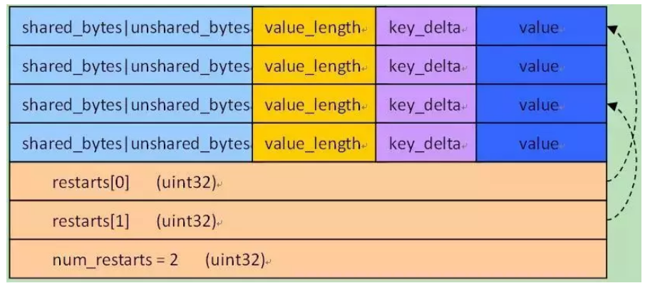

# leveldb source code analysis

[toc]

I reference to the source code of [leveldb](https://github.com/google/leveldb) and some blogs such as [leveldb源码分析](https://github.com/balloonwj/CppGuide/tree/master/articles/leveldb%E6%BA%90%E7%A0%81%E5%88%86%E6%9E%90).

The architecture of `leveldb` is shown in Figure 1.


 <div align = "center">Figure 1: leveldb architecture</div> 

Here I will introduce each data structures as below.

## Basic Components

### Coding

* For fixed int(32 bits or 63 bits), it simply uses a buffer to store the int. Here, it uses `little-endian` way.

* For var int, we split the integer seven by seven. In the non-terminating seven bits, we set its flag as 0. In the terminating seven bits, we set its flag as 1.

  

### Slice

Slice is a simple representation of a string with its size. It is defined in `include/leveldb/slice.h`.


### Key

Here we have three kinds of key:

* `User Key`
* `InternalKey`
* `ParsedInternalKey`
* `LookupKey`

#### User Key

`User Key` is a `Slice`. 

#### InternalKey

`InternalKey` has a string that consists of `User key`, `sequence number` and `value type`. It has a format of

```
| User key (string) | sequence number (7 bytes) | value type (1 byte) |
```

#### ParsedInternalKey

`ParsedInternalKey` is a struct that contains those fields.

```cpp
struct ParsedInternalKey {
  Slice user_key;
  SequenceNumber sequence;
  ValueType type;
}
```

#### LookupKey

`LookupKey` is for lookup in `Memtable`. It has the format of

```
size | User key (string) | sequence number (7 bytes) | value type (1 byte) |
```

Where size is a `varInt` and it equals to (size of key) + 8.


### Arena

Arena is a memory pool that manages the allocation and free of memory.

It has four fields:

* `alloc_ptr_` points to the first byte of free area

* `alloc_bytes_remaining_` as remaining size
* `blocks_` as an array of new allocated memory blocks
* `memory_usage_` as total memory usage of the arena

#### Allocate

When allocating `n` bytes,

If `n` < `alloc_bytes_remaining_` ,we just allocate the space in this block

Else, invoke `AllocateFallback()` to allocate a new block.

We set `k` as the size of a block. If `n` > `k/4`, then we allocate a new block of size `n`; Else we allocate a new block of size `k` 


### Comparator

Comparator is used to compare keys. It has the interface of 

* `Compare()` to compare two user keys
* `FindShortestSeparator()`: Given char `key` and `limit` and `key` < `limit`, we find the smallest char `result` such that `key` < `result` <= `limit`
* `FindShortSuccessor()`:  Given char `key`, we find the smallest char that is greater than `key`.

Class `BytewiseComparatorImpl` and `InternalKeyComparator` implement `Comparator`.

#### BytewiseComparatorImpl

`BytewiseComparatorImpl` compares keys in in a bytewise way.(defined in `util/comparator.cc`)

#### InternalKeyComparator

`InternalKeyComparator` compares keys (defined in `db/dbformat.h`)

It compares `InternalKeys` by increasing user key and decreasing sequence number.

`FindShortSuccessor` gets the successor of user key, and then appends `kMaxSequenceNumber|kValueTypeForSeek`


## Memtable

Memtable is sorted by key and its core data structure is a skipList. It has several interface methods:

* `Ref()`
* `Unref()`
* `NewIterator()`
* `Add()`
* `Get()`

### Reference count

Memtables are reference counted. It uses `Ref()` to add the reference count. If the reference count is 0, then it will be deleted in method `Unref()`.

### Iterator


### Add

Defined in `db/memtable.cc`.

When we are trying to add a key-value pair, we will build a buffer of this format

```
| VarInt(Internal Key size) len | internal key |VarInt(value) len |value|
```

And then insert this buffer into `skipList`.

### Get

Defined in `db/memtable.cc`.

Given a `LookupKey`, we use a iterator to seek that key in the skipList.

If we have found that key, we will check the type of that key. If it is `kTypeValue`, then, it is valid; If it is `kTypeDeletion`, then it shows that the key has not been found.


### SkipList

Skip list is defined in `db/skipList.h`.

`SkipList` has these interfaces:

* `Insert()`: insert a key into `SkipList`
* `Contains()`: check whether `SkipList` contains the key
* `Iterator()`: return an iterator for the `SkipList`

#### Search

It calls method `FindGreaterOrEqual()` to search, which is a classical way for skipList(shown as Figure 2).


 <div align = "center">Figure 2: SkipList search</div> 

#### Insert

When we are trying to insert a key, we first search this key by calling `FindGreaterOrEqual()`.

After getting the location to insert, we call `RandomHeight()` to get the height of that node.

Then, we can easily insert that node that represents the key.

BTW, we can encapsulate the `skipList` into a `Iterator`.

#### Node

The node of `SkipList` is defined as `Node`, and it has certain fields:

* `key`: The key in the node
* `next_[]`: next_[i] points to next node on the `i`th level.  

`Node` uses `std::memory_order_xxx` for thread safety.

## Log

For safety, we should first append the write operation to `log` before we update `Memtable`.

### Format

Log files are made up of a sequence of 32 KB blocks.

A block is made up of multiple records.

A record is made up of 

```
checksum: uint32     // crc32c of type and data[] ; little-endian
length: uint16       // little-endian
type: uint8          // One of FULL, FIRST, MIDDLE, LAST
data: uint8[length]
```

### Write


## SSTable

The file representation in disks.

### Format

In leveldb document, the format of a `SSTable` is shown below

```
<beginning_of_file>
[data block 1]       <----|
[data block 2]       <----|
...                       |
[data block N]       <----|
[meta block 1]  <--|      |
...                |      |
[meta block K]  <--|      |
[metaindex block] -|      |                                      <--|
[index block]-------------|                                      <--|
[Footer]        (fixed size; starts at file_size - sizeof(Footer)) -|
<end_of_file>
```

There are several blocks:

* `data block`: It stores the sorted sequence of key-value pairs.

* `meta block`: Aka `filter block`, and it stores bloom filters for a data block.

* `metaindex block`: It contains an entry for each `meta block` in this `SSTable`. For the entry, key is the name of `meta block` and value is a `blockHandle` pointing to that `meta block`.

* `index block`: It contains an entry for each data block. For each entry, key is a string >= last key in that data block and  < the first key in the successive data block, and the value is the `blockHandle` for that data block.

* `footer`: It is located at the end of a `SSTable` and has fixed length. It mainly contains the `blockHandle` of `metaindex block` and `index block`. 

  So the footer is like

  ```
  metaindex_handle: char[p];     // Block handle for metaindex
  index_handle:     char[q];     // Block handle for index
  padding:          char[40-p-q];// zeroed bytes to make fixed length
                                  // (40==2*BlockHandle::kMaxEncodedLength)
  magic:            fixed64;     // == 0xdb4775248b80fb57 (little-endian)
  ```

### Block

#### Format

For `data block`,  `metaindex block` and `index block`, their storage format is the same. They all consist of block data, type and crc32.

```
block data  | type(1 byte) | crc32(4 bytes)
```

where type is the type of compression(such as snappy).

For block data, the read operation is done by class `Block` and its construction is done by class `BlockBuilder`.


`BlockBuilder` compresses the key by their shared prefix.

This way can save space but sacrifice index time. Therefore,  `leveldb` uses a `restart point`(that does not compress) for a constant interval.

For a key-value pair, it stores in block data with a format of

* `shared_bytes`: length of shared prefix
* `unshared_bytes`: length of unshared suffix
* `value_length`: length of value 
* `key_delta`: the string of unshared suffix
* `value`: the value in a key-value pair

As for `restart point`, its `shared_bytes` = 0


At the end of a block, it has 

* `restarts`:  It stores the offsets of each `restart point`
* `num_restarts`: the number of restart points


Therefore, the block structure is like Figure 3.



 <div align = "center">Figure 3: Block structure</div> 

#### Construction: BlockBuilder

(Defined in `table/block_builder.h`)

Class `BlockBuilder` mainly builds a block. It has several fields:

* `buffer_`: the content of block
* `restarts_`: a list of restart points
* `counter_`: the number of entry after the restart
* `last_key_`: the last added key

And `BlockBuilder` has several methods:

* `Reset()`: reset the content of the block
* `Add()`: add a key-value pair
* `Finish()`: to mark that the construction is finished and return a slice that represents that block.


For method `Add()`, it does the following steps to add a key value pair:

* it firstly make sure that the added key is greater than any key in the block(to make it sorted). 
* Then, it checks whether the added key is at the restart point.
*  Later, it computes the shared string between `last_key_` and the added key.

* At last, it add the key into the buffer and update state.


#### Read: Block and Block::Iter

(Defined in `table/block.h`)

Class `Block` mainly reads a block. Its mainly has these fields:

* `data_`: the pointer to block
* `size_`: the size of block
* `restart_offset_`: the offset of `restart_point` array in `data_`

`Block` has an important method: `NewIterator()`, which returns an iterator of the block(`Block::Iter`).


Inner class `Block::Iter` has fields:

* `constcomparator_`

* `data_`: points to the start of the block

* `restarts_`: the offset of restarts  

* `num_restarts_`

* `current_`: current entry's offset in data

* `restart_index_`: the index of restart point that the current entry is at

  

`Block::Iter` has some Interfaces:

* `Next()`: It runs `ParseNextKey()` to go to the next entry and get its key-value pair.
* `Prev()`: Firstly, it goes to the nearest restart point before the entry. Then, it keeps calling `ParseNextKey()` until it reaches the right entry.
* `Seek()`: Firstly, it uses binary search to find the last restart point whose key < target. Then, it keeps calling `ParseNextKey()` until it reaches the first key such that key >= target. 


### Construction: TableBuilder

Here I introduce how to build a `SSTable`. It is done by class `TableBuilder` and defined in `include/leveldb/table_builder.h`.

`TableBuilder` has these interface:

* `Add()`: add a new key-value pair to current table
* `Flush()`: flush all cached key-value into the file
* `Finish()`: finish the construction of the current `SSTable`

`TableBuilder` has its fields in `TableBuilder::Rep`:

```
Options options;              // data block的选项
Options index_block_options;  // index block的选项
WritableFile* file;           // sstable文件
uint64_t offset; 
// 要写入data block在sstable文件中的偏移，初始0
Status status;                //当前状态-初始ok
BlockBuilder data_block;      //当前操作的data block
BlockBuilder index_block;     // sstable的index block
std::string last_key;         //当前data block最后的k/v对的key
int64_t num_entries;          //当前data block的个数，初始0
bool closed;                  //调用了Finish() or Abandon()，初始false
FilterBlockBuilder*filter_block; 
//根据filter数据快速定位key是否在block中
bool pending_index_entry;     //见下面的Add函数，初始false
BlockHandle pending_handle;   //添加到index block的data block的信息
std::string compressed_output;//压缩后的data block，临时存储，写入后即被清空
```


Method `Add()` of  `TableBuilder` works as follow:

1. Make sure that current file is not closed and finished. Also make sure that the added key is the largest in current file.
2. If we have entered an empty data block, we will record the index of last index block.
3. We also add the key into the filter block
4. We set `last_key` = `key`, and then add the key into data_block
5. If the number of data block exceeds the limit, we will flush it into the file


Method `Flush()` of `TableBuilder` works as follow:

1. Make sure that the data block has been written
2. Call `WriteBlock()` to write the data block into disk

Method `WriteBlock()` gets the serialized slice of the block, and may compress the slice. Then it calls `WriteRawBlock()` to write the block.

In method `WriteRawBlock()`, it first set the index handle info of data block. Then, it writes the block contents into the file


Method `Finish()` of `TableBuilder` denotes that the current `SSTable` has been persistent and closed. It works as follow:

1. Call `Flush()` to write the last data block into disk
2. Call `WriteRawBlock()` to write filter block into disk
3. Write the index of filter block into meta index block, and write meta index block into disk
4. write the index of data block into index block, and write index block into disk
5. write the handle of meta index block and index block, then write footer into disk

### Read: Table

`SSTable`'s Read operation is defined in class `Table`.(Defined in `include/leveldb/table.h`) 


Method `Open()` in `Table`:

1. Read `Footer` and parse it
2. Read index block by `Footer`
3. construct `Rep` in `Table` object

Method `BlockReader()` in `Table`:


### Iterate Table

Class `Table` can get an `Iterator` by calling method `NewIterator()`, which returns a `TwoLevelIterator`.

`TwoLevelIterator` can iterate and parse different kinds of blocks(Same format but different meanings).


Method `Seek()` in `TwoLevelIterator`:

1. Given the target, seek index
2. Given `index_iter`, seek data block


### Bloom Filter

Defined in class `FilterPolicy` in `include/leveldb/filter_policy.h`.

To be done


## Table Cache

`TableCache` maintains a LRU cache to cache all `Table` object.

It has several interfaces:

* `Evict()`: Given a file, it clears all its entry in cache.
* `Get()`: It seeks an entry of a given internal key.


Method `Get()` works as below:

1. Calls `FindTable()`to get the cache of the table
2. In cache, calls `Table::InternalGet()` to get the entry.

```cpp
Status TableCache::Get(const ReadOptions& options, uint64_t file_number,
                       uint64_t file_size, const Slice& k, void* arg,
                       void (*handle_result)(void*, const Slice&,
                                             const Slice&)) {
  Cache::Handle* handle = nullptr;
  Status s = FindTable(file_number, file_size, &handle);
  if (s.ok()) {
    Table* t = reinterpret_cast<TableAndFile*>(cache_->Value(handle))->table;
    s = t->InternalGet(options, k, arg, handle_result);
    cache_->Release(handle);
  }
  return s;
}
```


For method `FindTable()`:

It firstly search table in cache. If it has found it, return success; Otherwise, It opens that table from disk file and insert that table into cache.

To be done...


## DB Open


## DB Get


